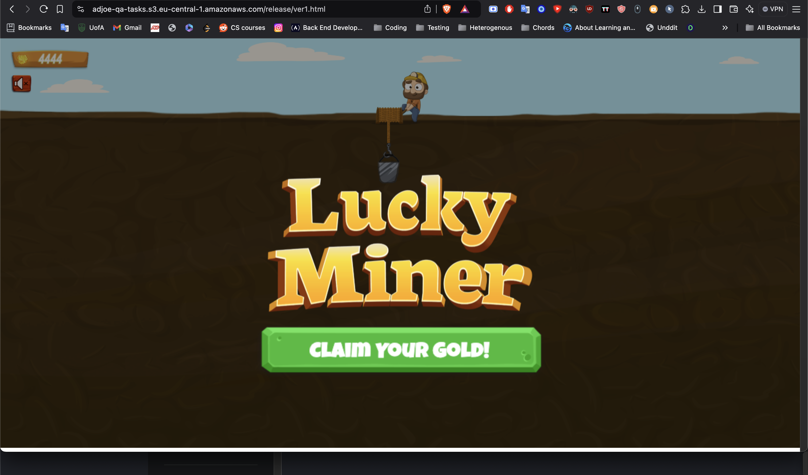
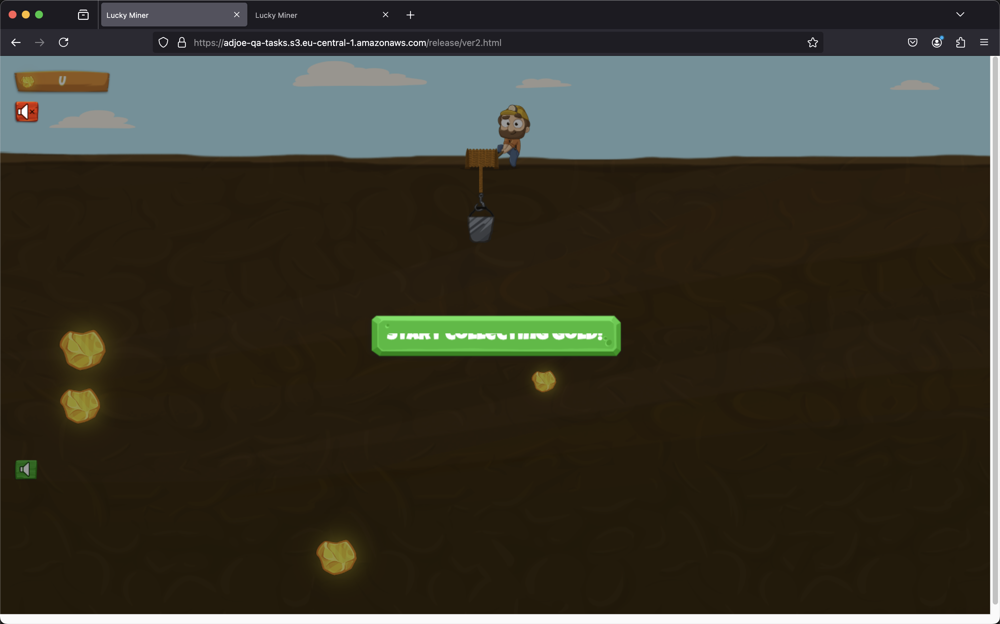
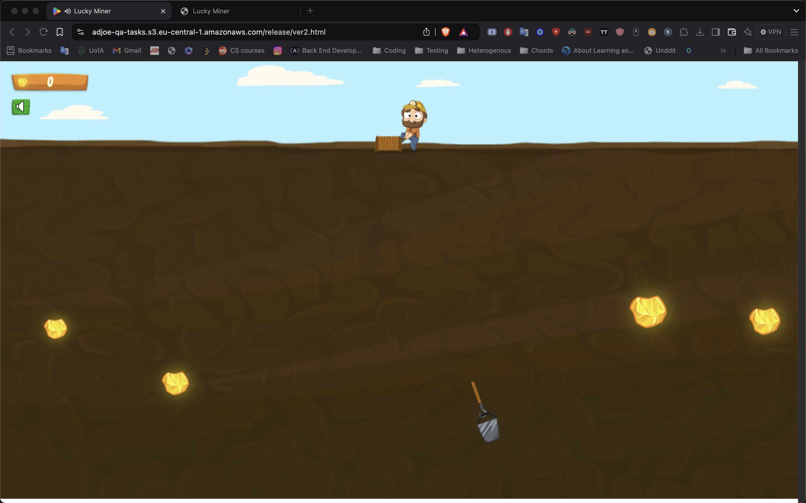

## Solution for Question 1

#### The Product Concept
The product is an online game where user plays as a miner; user can click the mouse while a shovel is moving in a pendulum motion to collect gold to target the buried gold and collect it to win points.

### Bugs
Bug 1

Summary:
Player is not shown the 'lucky miner' text when winning

Steps to reproduce:
1. Open the app on version 2
2. Collect all gold pieces

Expected result: The player is shown a 'lucky miner' text upon winning

Actual result: The 'lucky miner' text is missing (see attached)

Environment:
- Browser: Brave version 1.73.105 (reproducible on chrome and Android 15)
- macOS: Sequoia 15.2
- Environment: https://adjoe-qa-tasks.s3.eu-central-1.amazonaws.com/release/ver2.html

Severity:
- Medium

Priority:
- High

---
Bug 2
On firefox, when starting the app, the text 'START COLLECTION GOLD' in the start button is truncated

Steps to reproduce:
1. Open the app on firefox

Expected result: 'START COLLECTION GOLD' should be shown and readable

Actual result: 'START COLLECTION GOLD' is truncated

Environment:
- Browser: Firefox version 134.0.1
- macOS: Sequoia 15.2
- Environment: https://adjoe-qa-tasks.s3.eu-central-1.amazonaws.com/release/ver2.html

Severity:
- Medium

Priority:
- High

---
Bug 3

Summary:
Player's rope appears to be detached from bucket

Steps to reproduce:
1. While the bucket is moving, click anywhere on the screen

Expected result: The bucket moves in the direction where the mouse was clicked and a rope seems to be attached from the miner's position to the bucket as it extends

Actual result: The bucket moves in the direction where the mouse was clicked. but it's detached from the miner's position (see attached)

Environment:
- Browser: Brave version 1.73.105 (reproducible on chrome and Android 15)
- macOS: Sequoia 15.2
- Environment: https://adjoe-qa-tasks.s3.eu-central-1.amazonaws.com/release/ver2.html

Severity:
- Medium

Priority:
- Medium

---
Potential Bug 4

Summary:
Player's bucket appears to move faster the smaller the screen gets. This appears to be behavior similar to version 1, so I'd check with the dev team first before flagging it

Steps to reproduce:
1. Open the app [here](https://adjoe-qa-tasks.s3.eu-central-1.amazonaws.com/release/ver2.html) on a desktop app
2. Click anywhere the move the bucket
3. Repeat the same steps on a smaller device (mobile phone) or use the chrome dev tools to simulate smaller screen size/resolution

Expected result: The bucket should move at constant speed across devices

Actual result: The bucket moves faster the smaller the screen gets (slowest on 27 inch screen and fastest on a 6.7 inch mobile device)

Environment:
- Browser: Brave version 1.73.105 (reproducible on chrome and Android 15)
- macOS: Sequoia 15.2
- Environment: https://adjoe-qa-tasks.s3.eu-central-1.amazonaws.com/release/ver2.html

Severity:
- low

Priority:
- low

### QA Process

1. Test planning:
- I'd start by establishing testing goals and requirements for each bug
- Identify the scope of each feature, do more exploratory testing on the product and ask the developers what features each bug is a part of to define/quantify defect density
- Lay out the resources given as well as the deadline (if any) to know how much resources to allocate and how much time it will be estimated for testing

2. Test design:
- Design tests for to make sure that each bugs is fixed along with edge cases
- Make sure to cover a myriad of devices, operating systems, and configurations. I can learn more about our target audience by consulting our metrics, research, and analytics tools to know what systems the users use the most to use the product (for example do they use mostly desktop or mobile)
- After the test cases are created, get them approved/review by a peer QA engineer to make sure we have another opinion and that we have more people involved in the creation process

3. Test environment setup:
- Complementing the test design, make sure you have various test environments ready for testing with different browsers such as chrome, brave, edge safari.
 Mobile devices like iOS and android, we can utilize the chrome dev tools and BrowserStack to have access to virtual devices with variable screen sizes. Operating systems like windows and macOS as well should be covered by testing

 4. Test execution:
 - Manual tests: make sure we cover different UI/UX elements as well as edge cases. If there's access to physical devices of different screen sizes, perform manual tests on these too.
 - Automated tests: We can use tools like Selenium and Playwright to perform repetitive regression tests
 - Make sure to always have visual aids (screen recordings and screenshots) even in cases of passing tests as test evidence
 - Make sure to utilize bug tracking tools (jira) to track testing progress

 5. Defect management:
 - Identify areas of defects or bugs
 - Try to quantify defect density (if applicable) to find out if one area/feature is more buggy than the rest and relay that info with the dev team

 6. Regression testing:
 - After testing and making sure that the main bug was fixed, rin full regression to make sure no areas were affected by the fix made
 - This is very crucial as to not introduce any issues to the customers

 7. Performance and load testing:
 - Make sure the load testing metrics are up to bar (how many users can use the app at the same time or how many requests can the app handle at the same time - throughput)
 - Coordinate the results with the dev team to find out if they're satisfactory

 8. Closing notes:
 - Share notes after testing with the QA team as well as the dev team
 - Review tess metrics and summarize on confluence for example for future reference/improvement
 - For tools that can be used during testing, I'd suggest an automation framework such as Selenium or Playwright, they can work with different languages so I'd go with Python, JavaScript or TypeScript (for type safety) as they're relatively easy to pick up. I'd also utilize a CI/CD platform such as Jenkins to handle running regression tests